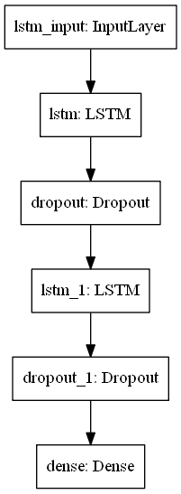
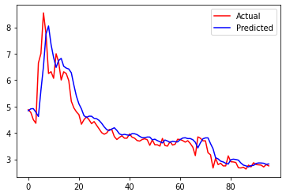
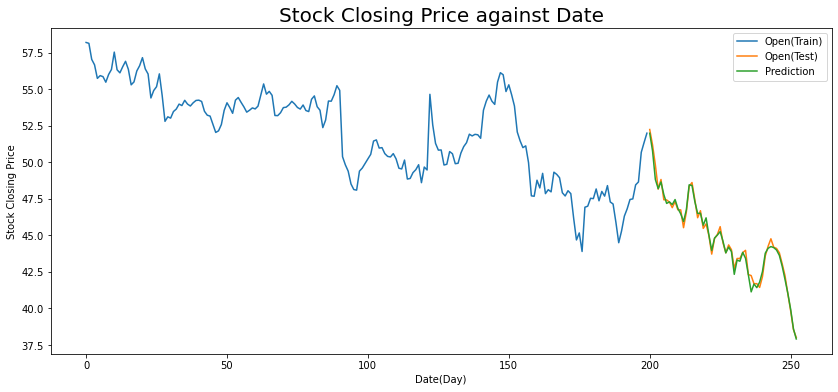
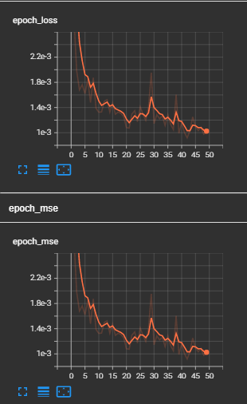

## Time Series Forecasting Stock Price
1. Predicting Top Glove stockvopen price using a deep learning model.
2. Predicting Predicting Intel Corporation (INTC) stock open price using macine learning model.

## Contents
This repository contains 3 python files (DL_train.py, ML_train.py, modules.py).
DL_train.py contains the codes to build a deep learning model to make the prediction.
ML_train.py contain the codes to build a linear regression model to make prediction.
modules.py contains the codes where there are class and functions to be used in train.py.

## How run Tensorboard

1. Clone this repository and use the model.h5, mms_scaler.pkl (inside saved_model folder) to deploy on your dataset.
2. Run tensorboard at the end of training to see how well the model perform via Anaconda prompt. Activate the correct environment.
3. Type "tensorboard --logdir "the log path"
4. Paste the local network link into your browser and it will automatically redirected to tensorboard local host and done! Tensorboard is now can be analyzed.

### The Architecture of DL Model

# The Performance of models
DL Model Performance

ML Model Performance

## Tensorboard screenshot from my browser

